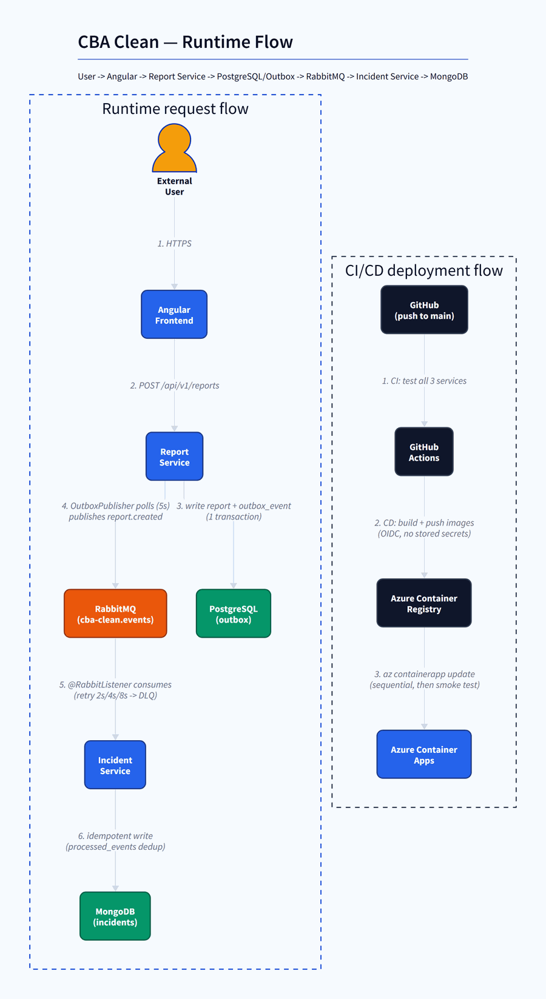

# cba-clean

CBA Clean is a portfolio project for citizen waste reports: citizens submit
reports (Report Service, PostgreSQL), which are published as integration events
over RabbitMQ and turned into incidents (Incident Service, MongoDB).

## Live Demo

The application is deployed on Azure Container Apps:

**https://cba-clean-web.delightfulbay-5c84ea15.centralus.azurecontainerapps.io/**

Login is restricted rather than open to the public, to keep the Azure
compute/database costs and RabbitMQ/Mongo usage on this portfolio deployment
under control and to prevent abuse of the report/incident endpoints. If
you'd like to try the reporter or operator flow, please
[open an issue](https://github.com/luisarce02/cba-clean/issues) or contact
the repository owner to request demo credentials.

## Latest Release

**[v1.0.0 — CBA Clean v1.0.0 — Production-Ready Full-Stack Waste Management Platform](https://github.com/luisarce02/cba-clean/releases/tag/v1.0.0)**

First stable release: Java 21 + Spring Boot microservices, Angular frontend,
Keycloak/OAuth2/OIDC authentication, PostgreSQL + MongoDB, RabbitMQ with SSL,
Azure Container Apps deployed via Bicep IaC, and a GitHub Actions CI/CD
pipeline (Azure OIDC, ACR image push, automated deployment, post-deployment
smoke tests).

## Architecture at a glance

```
citizen -> Report Service (PostgreSQL)
               |  one PostgreSQL transaction:
               |  reports + outbox_events
               v
          Outbox Publisher  (polls pending events)
               |
               v
           RabbitMQ  (cba-clean.events exchange)
               |
               v
           Incident Service (MongoDB) - consumes report.created,
           opens incidents, idempotent via processed_events claims
```

## Architecture

The diagrams below are generated from the project's actual architecture
(queried via the repository's knowledge graph and cross-checked against
`docker-compose.yml`, the CI/CD workflows, and the Azure/Bicep infra configs),
not hand-drawn.

**System architecture** - application, infrastructure, databases, messaging,
authentication, and the CI/CD pipeline:



**Runtime & deployment flow** - the report -> RabbitMQ -> incident flow and the
GitHub Actions -> ACR -> Azure Container Apps deployment flow, animated:



See [`docs/architecture/README.md`](docs/architecture/README.md) for the D2
source and the commands to reproduce or edit both diagrams.

## Transactional Outbox

**Why the direct approach was unsafe.** Previously the Report Service saved the
report to PostgreSQL and then published `ReportCreatedEvent` straight to
RabbitMQ. Those are two separate systems - if the broker was unavailable after
the commit, the report existed but its event was lost forever. There was no way
to make "database write + broker publish" atomic.

**How the outbox solves it.** Submitting a report now persists the aggregate
and its integration event in **one PostgreSQL transaction** (`reports` +
`outbox_events`). A successful `POST /api/v1/reports` therefore guarantees the
event is durably stored, no matter what state RabbitMQ is in. Publication is
asynchronous: a scheduled publisher polls pending events and delivers them to
RabbitMQ, marking an event `PUBLISHED` only after the broker's **publisher
confirm** arrived. If RabbitMQ is down, events simply stay pending and are
retried on every poll round - submissions keep succeeding while the broker is
offline.

**Delivery semantics: at-least-once.** The publisher can crash between broker
acceptance and marking the row published, so an event may be delivered more
than once. Exactly-once delivery across two systems is not achievable with this
pattern alone - which is why Incident Service idempotency (claim-first
deduplication on `eventId`) remains in place. Outbox retry covers *"the broker
was unavailable while publishing"*; consumer retry/DLQ covers *"the consumer
received the event but processing failed"*. The two mechanisms solve different
problems.

**Outbox details**

- Table `outbox_events` (Flyway `V2__create_outbox_events_table.sql`); its
  primary key is the integration event's `eventId`, so one identity flows from
  PostgreSQL through RabbitMQ headers into Incident Service idempotency.
- Lifecycle: `PENDING -> PUBLISHING -> PUBLISHED`; failed attempts return to
  `PENDING` with bounded metadata (`attempts`, `last_attempt_at`,
  `last_error`). Only broker-confirmed messages ever become `PUBLISHED`.
- Claiming uses `SELECT ... FOR UPDATE SKIP LOCKED`, so scaled-out publisher
  instances never work on the same event.
- Configuration (prefix `cbaclean.outbox`): `poll-interval` (default `PT5S`),
  `batch-size` (default `20`), `publish-confirm-timeout` (default `PT5S`);
  overridable via environment (`OUTBOX_POLL_INTERVAL`, ...).

## Messaging architecture

- **Main exchange**: `cba-clean.events` (topic, durable) -
  the Report Service publishes `ReportCreatedEvent` with routing key
  `report.created` (via the transactional outbox publisher).
- **Main queue**: `incident-service.report-created` (durable), bound to the
  main exchange. It is declared with dead-letter routing
  (`x-dead-letter-exchange=cba-clean.dlx`,
  `x-dead-letter-routing-key=incident-service.report-created.dlq`) so that
  deliveries rejected without requeue by the listener container itself (e.g.
  fatally malformed JSON that can never be deserialized) land directly in the
  DLQ.
- **Retry strategy**: bounded TTL retry queues. On a transient processing
  failure the consumer republishes the message to the dead-letter exchange with
  a per-retry routing key; each retry queue waits its configured TTL and then
  dead-letters the message back to `cba-clean.events/report.created`, producing
  a delayed redelivery:

  ```
  incident-service.report-created.retry.1   (TTL 2s)
  incident-service.report-created.retry.2   (TTL 4s)
  incident-service.report-created.retry.3   (TTL 8s)
  ```

- **Retry limits**: 3 retries after the initial delivery (up to 4 attempts).
  The retry count travels in an `x-retry-count` message header. When the limit
  is reached, the message is routed to the DLQ instead of another retry.
- **Dead-letter exchange / queue**: `cba-clean.dlx` (topic, durable) routes
  into `incident-service.report-created.dlq` (durable). All retry and DLQ
  infrastructure lives under `infrastructure/messaging`
  (`MessagingTopology`, `ReportCreatedEventRetryRouter`).
- **Poison messages** are never retried: unknown report types or priorities
  (`EventTranslationException`) and structurally invalid JSON go straight to
  the DLQ, where they remain available for inspection.
- **Configuration**: `incident.messaging.retry.max-retries` (default `3`) and
  `incident.messaging.retry.delays` (default `2s,4s,8s`); overridable via
  environment (`INCIDENT_RETRY_MAX_RETRIES`, `INCIDENT_RETRY_DELAYS`).

### Relationship with idempotency

Idempotency is unchanged and claim-first: before invoking the use case, the
consumer atomically claims the event's `eventId` in MongoDB
(`processed_events`). A consequence worth knowing: if processing fails *after*
the claim was consumed, the retried delivery is skipped as already claimed -
no incident is created for it. Retries therefore repair transient failures up
to and including the claim (e.g. MongoDB briefly unavailable); closing the
claim-to-persist window would require transactional writes in MongoDB, which is
out of scope here. Combined with the Report Service's transactional outbox,
duplicate deliveries are expected and safe: the outbox guarantees the event is
never lost, idempotency guarantees duplicates create exactly one incident.

### One-time migration note

The main queue's arguments changed (it now carries dead-letter declarations).
An existing RabbitMQ volume still holds the old argument-less declaration, so
one upgrade requires deleting the old queue (or running
`docker compose down -v` for local development) before starting the new
incident service.

## Observability

### Health & metrics endpoints

Both services expose a deliberately small Actuator surface
(`management.endpoints.web.exposure.include=health,info,metrics,prometheus`;
sensitive endpoints such as `env`, `beans`, `configprops`, `mappings`,
`heapdump` and `threaddump` are disabled):

- **Health**: `http://localhost:8080/actuator/health` (Report Service),
  `http://localhost:8081/actuator/health` (Incident Service)
- **Metrics index**: `/actuator/metrics` - lists all meters; single meters via
  `/actuator/metrics/{name}`
- **Prometheus scrape endpoint**: `/actuator/prometheus` - ready for a
  Prometheus server in a later step

### Business & messaging metrics (`cbaclean.*`)

| Metric | Meaning |
|---|---|
| `cbaclean.reports.created` / `cbaclean.reports.failed` | reports persisted / submissions failed |
| `cbaclean.report.creation.duration` | timer over the complete submission operation (`result=success/failure`) |
| `cbaclean.outbox.events.pending` | gauge of outbox events awaiting publication |
| `cbaclean.outbox.events.published` / `.publish.failures` | outbox publication outcome (broker-confirmed / failed attempts) |
| `cbaclean.incidents.created` / `cbaclean.incidents.failed` | incidents persisted / incident creation failed |
| `cbaclean.incident.events.processed` | events processed successfully |
| `cbaclean.incident.events.duplicates` | duplicates skipped by idempotency |
| `cbaclean.incident.events.retries` | events scheduled onto the retry chain |
| `cbaclean.incident.events.dead_lettered` | events sent to the DLQ (`reason=retry_exhausted/translation_failure`) |
| `cbaclean.incident.event.processing.duration` | timer over event processing attempts |

Only bounded, low-cardinality tags are used (`eventType`, `result`, `reason`);
identifiers (reportId/incidentId/eventId/correlationId) are never attached to
metrics - they belong to logs.

### Correlation IDs & structured logs

Every HTTP request gets an `X-Correlation-ID` (generated if absent, preserved
if valid) which travels in RabbitMQ message headers into the Incident Service.
It is carried in the SLF4J MDC, rendered in every log line
(`[correlationId=...]`) and cleared after each request/message, so a report can
be traced end-to-end across both services with `grep correlationId=<id>`.

## Security / JWT

Both services use **JWT Bearer authentication** via Spring Security's OAuth2
Resource Server. The security boundary lives at the presentation layer; no
domain or application code has any security dependency.

### Authentication model

- Tokens must be signed (RS256) and carry a `roles` claim containing a JSON
  string array of role names (e.g. `["REPORTER","OPERATOR"]`).
- Two roles are used:
  - **`REPORTER`** - create and retrieve waste reports.
  - **`OPERATOR`** - operational access (actuator metrics/prometheus).

### Endpoint policy

| Endpoint | Access |
|---|---|
| `/actuator/health`, `/actuator/info` | Public |
| `/api/v1/reports/**` | `ROLE_REPORTER` or `ROLE_OPERATOR` |
| `/actuator/metrics`, `/actuator/prometheus` | `ROLE_OPERATOR` |
| Everything else | 404 (no security error) |

### Expected behavior

- **401 Unauthorized** when unauthenticated or token is invalid (expired,
  tampered, malformed).
- **403 Forbidden** when authenticated but the token lacks the required role.
- Security failures never reveal why the token was rejected or leak
  `Authorization` header values into logs.

### JWT configuration

Exactly one token signature source must be configured:

| Environment variable | Property | Default | Purpose |
|---|---|---|---|
| `JWT_ISSUER_URI` | `spring.security.oauth2.resourceserver.jwt.issuer-uri` | `http://localhost:9000` | OIDC issuer for token signature validation (lazy - service starts even while issuer is unreachable) |
| `JWT_JWK_SET_URI` | `spring.security.oauth2.resourceserver.jwt.jwk-set-uri` | *(blank)* | Alternative: direct JWKS endpoint |
| `JWT_AUDIENCE` | `cbaclean.security.jwt.audience` | *(blank = disabled)* | Optional audience validation (`aud` claim check) |

### RabbitMQ and Incident Service

Incident Service consumes `ReportCreatedEvent` messages from RabbitMQ. RabbitMQ
messages are authenticated by the broker connection, not by JWTs; HTTP security
on the Incident Service secures only the Actuator surface (the service has no
REST API).

### Local testing

Integration tests use an in-memory RSA key pair (`TestJwts` utility) to mint
signed tokens with arbitrary roles - no external identity provider is needed.
The security integration test (`ReportApiSecurityIntegrationTest`) drives the
complete HTTP security chain against real PostgreSQL and RabbitMQ containers.

## Local Authentication

CBA Clean uses **Keycloak** as the local development Identity Provider. Keycloak
issues JWT access tokens that the backend validates, providing a complete
authentication flow for local development.

### Realm

- **Realm name**: `cba-clean`
- **Realm configuration**: `keycloak/realm/cba-clean-realm.json` (auto-imported on startup)

### Roles

| Role | Description |
|---|---|
| `REPORTER` | Create and read reports (POST/GET `/api/v1/reports`) |
| `OPERATOR` | Operational access (actuator metrics/prometheus, GET reports) |

### Development users

| Username | Password | Role | Purpose |
|---|---|---|---|
| `reporter` | `reporter` | `REPORTER` | Can create and read reports |
| `operator` | `operator` | `OPERATOR` | Can access metrics/prometheus and read reports |

**These credentials are for local development only. Never use them in production.**

### Login flow

1. User clicks "Login" in the Angular app
2. Angular redirects to Keycloak authorization endpoint (PKCE flow)
3. User authenticates with Keycloak credentials
4. Keycloak redirects back with an authorization code
5. Angular exchanges the code for JWT access tokens
6. JWT is stored in localStorage and attached to API requests via `Authorization: Bearer` header

### Logout flow

1. User clicks "Logout" in the Angular app
2. JWT is cleared from localStorage
3. Angular redirects to Keycloak end-session endpoint
4. Keycloak session is terminated

### Service configuration

Both services validate JWT tokens issued by Keycloak:

| Environment variable | Docker Compose value | Purpose |
|---|---|---|
| `JWT_ISSUER_URI` | `http://keycloak:8080/realms/cba-clean` | Keycloak realm issuer for JWT validation |
| `JWT_JWK_SET_URI` | *(blank)* | Alternative: direct JWKS endpoint |
| `JWT_AUDIENCE` | `cba-clean-web` | Expected audience in JWT |

### Angular authentication flow

1. **PKCE**: Authorization Code flow with Proof Key for Code Exchange
2. **Discovery**: OIDC discovery document loaded from Keycloak
3. **Token storage**: Access token stored in localStorage (with expiry)
4. **Token attachment**: `Authorization: Bearer <token>` header added by HTTP interceptor
5. **Role extraction**: `roles` claim parsed from JWT for UI role checks (backend remains authoritative)

### How to start the stack

```bash
docker compose up -d --build
cd frontend/cba-clean-web
npm install
npm start
```

Then open:

- Angular: http://localhost:4200
- Keycloak: http://localhost:8090 (admin/admin)
- Report Service: http://localhost:8080
- Incident Service: http://localhost:8081
- RabbitMQ: http://localhost:15672

### Reset Keycloak

To reset Keycloak to a clean state:

```bash
docker compose down -v
docker compose up -d --build
```

The `-v` flag removes the Keycloak data volume, forcing a fresh import of the realm configuration.

## Running the stack

```bash
docker compose up -d --build
```

- Report Service API: http://localhost:8080/swagger-ui.html
- Incident Service health: http://localhost:8081/actuator/health
- RabbitMQ management UI: http://localhost:15672 (cbaclean/cbaclean)
- Keycloak Admin Console: http://localhost:8090 (admin/admin)

## Running the tests

```bash
cd backend/report-service  && ./mvnw test
cd backend/incident-service && ./mvnw test
```

Incident Service integration tests use Testcontainers (real RabbitMQ and
MongoDB containers), including tests for retry counts, configured delays, DLQ
routing of poison messages and idempotent duplicate handling.
