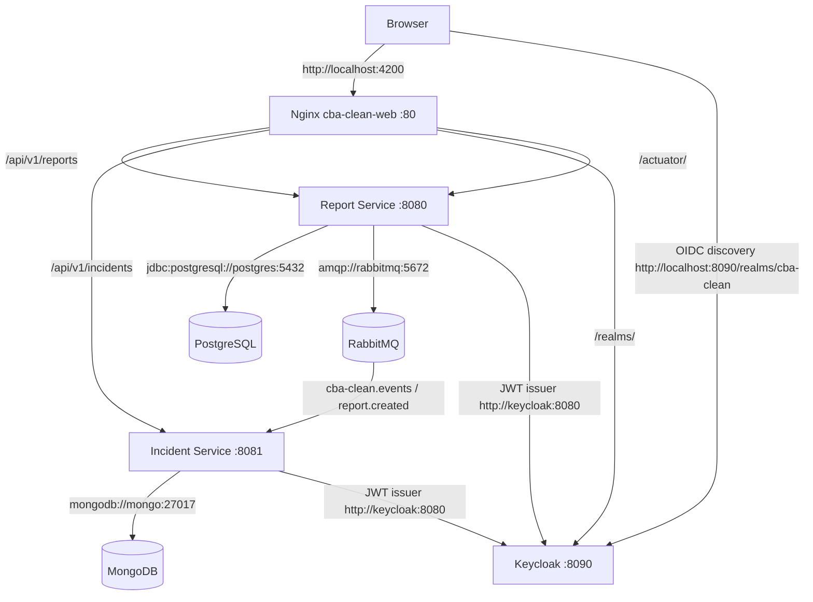
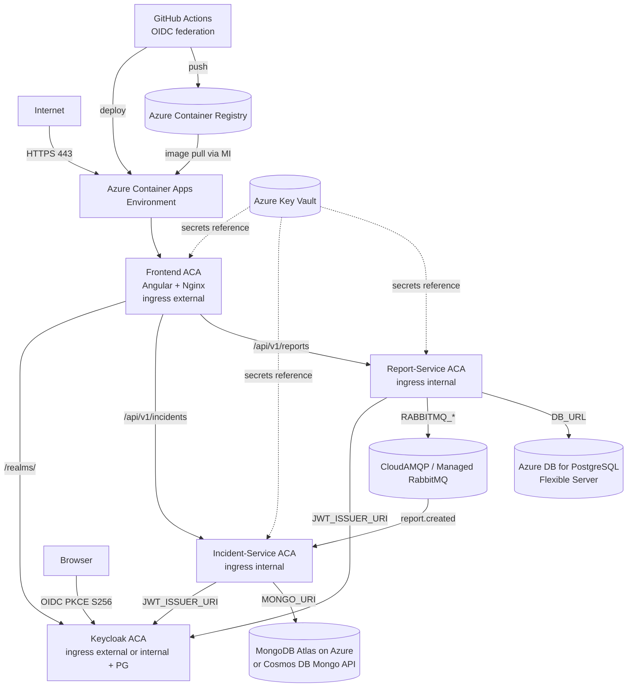

# CBA Clean — Azure Production Deployment Foundation

> **Scope:** Step 1 - Foundation only. No resources are provisioned in this step. The document prepares the repository for incremental Azure provisioning and makes the application Azure-ready without changing business logic, authorization semantics, or event-driven architecture.

> **Phase 1 Update 2026-08-27 — Azure for Students, `centralus`:** Subscription `Azure for Students` has policy `sys.regionrestriction` allowing only `brazilsouth, centralus, westus, chilecentral, mexicocentral`. Resource Group `cba-clean-rg` currently in `eastus2` (created outside policy) — resources for Phase 1 are deployed to `centralus` via `--parameters location=centralus` (RG location is metadata only). This doc updated for Phase 1 readiness; see §8-13 addendum.

---

## 1. Current Architecture (as found in repository)

### Services (docker-compose.yml:1)

| Service | Image / Build | Port | Persistent Volume | Depends On |
|---|---|---|---|---|
| `postgres` | `postgres:17-alpine` | 5432 | `cbaclean_pgdata` | — |
| `rabbitmq` | `rabbitmq:3.13-management` | 5672 / 15672 | `cbaclean_rabbitmqdata` | — |
| `keycloak` | `quay.io/keycloak/keycloak:26.1` | 8090→8080 | `cbaclean_keycloakdata` | — |
| `report-service` | `backend/report-service/Dockerfile` (Maven 3.9 + Temurin 21) | 8080 | — | postgres, rabbitmq, keycloak (healthy) |
| `mongo` | `mongo:7.0` | 27017 | `cbaclean_mongodata` | — |
| `incident-service` | `backend/incident-service/Dockerfile` | 8081 | — | mongo, rabbitmq, keycloak (healthy) |
| `cba-clean-web` | `frontend/cba-clean-web/Dockerfile` (Node 22 + Nginx 1.27) | 4200→80 | — | — (runtime proxy) |

### Communication graph



- **Transactional Outbox:** `report-service` writes `reports` + `outbox_events` in one PG transaction; `OutboxPublisher` (`backend/report-service/src/main/java/com/cbclean/report/infrastructure/outbox/OutboxPublisher.java:67`) polls `PENDING` every `PT5S` (`OutboxProperties` via `OUTBOX_POLL_INTERVAL`) and waits for RabbitMQ publisher confirms (`publisher-confirm-type=correlated` in `application.yml:30`).
- **Messaging topology:** Declared in `MessagingTopology.java` on both services; durable `cba-clean.events` (topic) + `cba-clean.dlx`, retry queues `incident-service.report-created.retry.{1,2,3}` with TTL `2s,4s,8s` (`IncidentMessagingRetryProperties`), DLQ `incident-service.report-created.dlq`.
- **JWT:** Both services are OAuth2 resource servers (`ReportServiceSecurityConfig.java:77`, `IncidentServiceSecurityConfig.java:69`). Roles from `roles` claim → `ROLE_*` via `RolesClaimAuthenticationConverter`. Audience validation via `JWT_AUDIENCE`. Lazy decoder avoids startup failure if issuer unreachable.
- **Actuator:** `management.endpoints.web.exposure.include=health,info,metrics,prometheus` (`application.yml:73`); only public is `health/info`, metrics/prometheus require `OPERATOR`.

### Localhost-specific values

| Location | Value | Production issue |
|---|---|---|
| `frontend/cba-clean-web/src/environments/environment.ts:3-7` | `apiBaseUrl: http://localhost:8080/api/v1`, `incidentApiBaseUrl: http://localhost:8081/api/v1`, `issuer: http://localhost:8090/realms/cba-clean`, `redirectUri: http://localhost:4200` | Hardcoded dev URLs - must be origin-relative or injected |
| `frontend/cba-clean-web/nginx.conf:13-24` | `http://report-service:8080`, `http://incident-service:8081`, `http://keycloak:8080`, `resolver 127.0.0.11` | Docker embedded DNS does not exist in Azure Container Apps |
| `docker-compose.yml:69-77,110-121` | `DB_URL: jdbc:postgresql://postgres:5432/cbaclean`, `MONGO_URI: mongodb://mongo:27017`, `RABBITMQ_HOST: rabbitmq`, `JWT_ISSUER_URI: http://localhost:8090/...`, `JWT_JWK_SET_URI: http://keycloak:8080/...`, `CORS_ALLOWED_ORIGINS: http://localhost:4200` | Compose service names not resolvable in Azure; must become ACA FQDNs |
| `backend/*/src/main/resources/application.yml:6-39` | Defaults `jdbc:postgresql://localhost:5432`, `mongodb://localhost:27017`, `localhost` for rabbitmq, `http://localhost:9000` for issuer | Safe local defaults (env-overridable), no change needed but must be overridden in prod |
| `keycloak/realm/cba-clean-realm.json:58-63,71` | `redirectUris: http://localhost:4200`, `webOrigins: http://localhost:4200`, `post.logout.redirect.uris: http://localhost:4200`, `sslRequired: none` | Must be replaced with production frontend origin + `external` for HTTPS |
| `docker-compose.yml:45-50` | `KC_HOSTNAME: http://localhost:8090`, `KEYCLOAK_ADMIN: admin` / `admin` | Dev-only credentials, hostname must be production FQDN |
| `keycloak/realm/cba-clean-realm.json:108-146` | Users `reporter/reporter` and `operator/operator` plaintext | Dev seed data only, never in production |

### Docker Compose networking dependencies

- `report-service` → `postgres`, `rabbitmq`, `keycloak` via service-name DNS (`postgres`, `rabbitmq`, `keycloak`).
- `incident-service` → `mongo`, `rabbitmq`, `keycloak`.
- `cba-clean-web` → all via Nginx variable upstreams with `resolver 127.0.0.11` (Compose embedded DNS).
- In Azure, Container Apps Environment provides internal DNS via FQDNs (not Compose names); ACA ingress is `https://<app>.<env>.<region>.azurecontainerapps.io`. Direct port mapping (e.g., `8080:8080`) is replaced by ACA `ingress` + `targetPort`.

### Persistent storage

- `cbaclean_pgdata` → PostgreSQL (`V1__create_reports_table.sql`, `V2__create_outbox_events_table.sql`)
- `cbaclean_mongodata` → MongoDB (`processed_events` for idempotency, `incidents`)
- `cbaclean_rabbitmqdata` → RabbitMQ exchanges/queues (durable, but messages must survive pod restart → requires managed RabbitMQ)
- `cbaclean_keycloakdata` → Keycloak dev-file DB (in production use Postgres, not dev-file)

---

## 2. Target Azure Architecture

### Service selection (evaluated per requirement §3)

| Component | Azure Service (chosen) | Justification |
|---|---|---|
| **Frontend / Nginx** | **Azure Container Apps (ACA)** | Keeps Node→Nginx multi-stage image; ACA supports `nginx:1.27-alpine` runtime, custom `env.js` injection, HTTPS ingress, and internal service discovery to backends. No rewrite needed beyond templating. |
| **Report Service** | **Azure Container Apps** (same Environment) | Spring Boot 21, stateless (outbox polling via DB), scales on HTTP + CPU. ACA's `publisher-confirm-type=correlated` works with external RabbitMQ. |
| **Incident Service** | **Azure Container Apps** | Consumes RabbitMQ, writes MongoDB; no REST aside from actuator - ACA ingress internal + health probe sufficient. |
| **PostgreSQL** | **Azure Database for PostgreSQL — Flexible Server** | Managed, supports Flyway, `pgcrypto` if needed, private VNet integration, backups. Preserves exact `reports`/`outbox_events` semantics. Alternative (Cosmos DB Postgres) rejected - keep vanilla PG. |
| **MongoDB** | **MongoDB Atlas on Azure** (primary) — **Azure Cosmos DB with MongoDB API** as acceptable alternative only if Atlas unavailable | Application uses Mongo semantics (`MongoIncidentRepository`, `ProcessedEventDocument` with unique `eventId` constraint). Atlas preserves Wire Protocol and deduplication guarantees; Cosmos DB Mongo API has RU-based quirks and partial aggregation - documented but not preferred. Do not auto-replace. |
| **RabbitMQ** | **CloudAMQP (Azure Marketplace) — or Azure-hosted RabbitMQ on ACA only with durable storage if CloudAMQP unavailable** | Managed durability required; ACA ephemeral RabbitMQ without persistent volume would lose `cba-clean.events` + retry/DLQ state. CloudAMQP provides dedicated `cba-clean.events` durable exchange, private endpoint, and management UI not exposed publicly. If self-hosted on ACA, must mount Azure Files and use `rabbitmq:3.13-management` with `RABBITMQ_DEFAULT_*` via Key Vault - not ephemeral. |
| **Keycloak** | **Azure Container Apps + Azure Database for PostgreSQL Flexible Server (separate DB)** — external managed Keycloak (e.g., Phase, Authentik) only if ops overhead objectionable | Portfolio: preserve exact realm (`cba-clean-realm.json`), PKCE S256, public client `cba-clean-web`, audience mapper. Running Keycloak in ACA with persistent PG (not `dev-file`) keeps realm import and `KC_HEALTH_ENABLED` path while keeping OIDC/JWT compatible. External provider would require realm migration. Not recommended to remove Keycloak. |
| **Container Registry** | **Azure Container Registry (ACR)** | `GitHub Actions → ACR → ACA` pipeline; `docker/build-push-action@v6` already validated in `ci.yml:89-100`. |
| **Secrets** | **Azure Key Vault + ACA secrets (Key Vault references)** | All passwords, connection strings via Key Vault; ACA `secrets` block references Key Vault via managed identity - no secrets in Git/Bicep/env. |
| **Identity** | **Managed Identity + GitHub OIDC federated credentials** | Avoid long-lived SP secrets in GitHub. ACA pull from ACR via `acrpull` role assignment to managed identity. |

> **Not introduced:** No Service Bus migration (would require changing `RabbitTemplate`/`@RabbitListener`), no Cosmos DB forced, no monolith merge.

### Diagram (target)



ACA ingress notes:
- `frontend` : `external: true`, `targetPort: 80`, HTTPS auto (managed certificate), CORS not needed for same-origin calls.
- `report-service` : `external: false` (internal only via frontend proxy) + health liveness `GET /actuator/health`.
- `incident-service` : `external: false`.
- `keycloak` : `external: true` if browser needs discovery, else `external: false` with frontend `/realms/` proxy - see §5.

---

## 3. Production Configuration Strategy

**Rule:** No secret, connection string, certificate, or production URL is hardcoded or committed. All runtime injection via ACA environment variables / Key Vault. Dockerfiles contain no `ENV` secrets.

### Non-secret configuration (plain ACA env vars)

| Variable | Example (prod) | Purpose |
|---|---|---|
| `REPORT_SERVICE_URL` | `https://report-service.<env>.azurecontainerapps.io` or `http://report-service:8080` internal | Nginx upstream - injected via `envsubst` |
| `INCIDENT_SERVICE_URL` | `https://incident-service.<env>.azurecontainerapps.io` | Nginx upstream |
| `KEYCLOAK_URL` | `https://keycloak.<env>.azurecontainerapps.io` | Nginx `/realms/` upstream |
| `FRONTEND_API_BASE_URL` | `/api/v1` (same-origin) | Browser → report API (runtime `env.js`) |
| `FRONTEND_INCIDENT_API_BASE_URL` | `/api/v1` | Browser → incident API |
| `FRONTEND_KEYCLOAK_ISSUER` | `https://keycloak.<domain>/realms/cba-clean` | OIDC discovery |
| `FRONTEND_KEYCLOAK_REDIRECT_URI` | `https://<frontend>.azurecontainerapps.io` | PKCE redirect |
| `JWT_ISSUER_URI` | `https://<keycloak>/realms/cba-clean` | Backend OIDC discovery |
| `JWT_JWK_SET_URI` | *(optional)* `https://<keycloak>/realms/cba-clean/protocol/openid-connect/certs` | Direct JWKS (if issuer not used) |
| `JWT_AUDIENCE` | `cba-clean-web` | Audience validator |
| `CORS_ALLOWED_ORIGINS` | `https://<frontend>.azurecontainerapps.io` | Locked to prod frontend |
| `SPRING_PROFILES_ACTIVE` | `prod` (if profile added) | Optional |
| `OUTBOX_POLL_INTERVAL` | `PT5S` | Outbox tuning |
| `OUTBOX_BATCH_SIZE` | `20` | Outbox tuning |
| `OUTBOX_PUBLISH_CONFIRM_TIMEOUT` | `PT5S` | Outbox tuning |
| `INCIDENT_RETRY_MAX_RETRIES` | `3` | Retry policy (same as dev) |
| `INCIDENT_RETRY_DELAYS` | `2s,4s,8s` | Retry delays |
| `KC_HOSTNAME` | `https://<keycloak>/` | Keycloak frontend URL |
| `KC_HOSTNAME_STRICT` | `true` | Prod hardening |
| `KC_PROXY_HEADERS` | `xforwarded` | Behind ACA ingress |

### Secrets (Key Vault → ACA secrets, never in Git)

| Variable | Service | Notes |
|---|---|---|
| `DB_URL` *without secrets* vs `DB_PASSWORD` | Report | `DB_URL=jdbc:postgresql://<flex>.postgres.database.azure.com:5432/cbaclean?sslmode=require` is non-secret; `DB_PASSWORD` is secret. `DB_USERNAME` is non-secret if not considered sensitive (but stored as secret for convenience). |
| `DATABASE_PASSWORD` / `DB_PASSWORD` | Report | Key Vault secret, ACA `secrets: [{name: db-password, keyVaultUrl: ...}]` |
| `RABBITMQ_PASSWORD` + `RABBITMQ_USERNAME` | Report, Incident | CloudAMQP credentials via Key Vault |
| `RABBITMQ_HOST` / `RABBITMQ_PORT` | Report, Incident | Non-secret host, but paired with secret password |
| `MONGO_URI` (including password) | Incident | Full URI is secret (`mongodb+srv://...`); alternatively split `MONGO_USERNAME`/`MONGO_PASSWORD` as separate secrets |
| `MONGO_PASSWORD` | Incident | If Atlas, password part of URI |
| `KEYCLOAK_ADMIN_PASSWORD` | Keycloak | Admin bootstrap only; alternatively set via Key Vault and disable admin after realm import |
| `KEYCLOAK_DB_PASSWORD` | Keycloak PG | If Keycloak uses Flexible Server |
| `ACR_PASSWORD` | *not needed* | Use managed identity, not secret |

Bicep never contains `defaultValue: '<password>'`. All `secure()` params reference Key Vault.

---

## 4. Complete Environment Variable Table (actual variables used)

Only variables that the code actually reads (`@Value`, `ConfigurationProperties`, docker-compose, Angular `environment`) are listed. Nothing invented.

| Variable | Service | Secret | Description | File Reference |
|---|---|---|---|---|
| `DB_URL` | report-service | No | JDBC URL. `application.yml:6` default `jdbc:postgresql://localhost:5432/cbaclean`. Compose: `jdbc:postgresql://postgres:5432/cbaclean`. Prod: `jdbc:postgresql://<flex>.postgres.database.azure.com:5432/cbaclean?sslmode=require` | `application.yml:6`, `docker-compose.yml:69` |
| `DB_USERNAME` | report-service | No* | DB user. Default `cbaclean`. | `application.yml:7` |
| `DB_PASSWORD` | report-service | **Yes** | DB password. | `application.yml:8` |
| `RABBITMQ_HOST` | report-service, incident-service | No | RabbitMQ host. Default `localhost`. Compose `rabbitmq`. | `application.yml:23,10` |
| `RABBITMQ_PORT` | report-service, incident-service | No | Port `5672`. | `application.yml:24,11` |
| `RABBITMQ_USERNAME` | report-service, incident-service | No* | User, default `cbaclean`. | `application.yml:25,12` |
| `RABBITMQ_PASSWORD` | report-service, incident-service | **Yes** | Password. | `application.yml:26,13` |
| `JWT_ISSUER_URI` | report-service, incident-service | No | OIDC issuer for lazy discovery. `http://localhost:9000` fallback, compose `http://localhost:8090/realms/cba-clean`. Prod issuer must match Keycloak FQDN. | `application.yml:39,21`, `ReportServiceSecurityConfig.java:148` |
| `JWT_JWK_SET_URI` | report-service, incident-service | No | Direct JWKS alternative. Empty by default. | `application.yml:40,22` |
| `JWT_AUDIENCE` | report-service, incident-service | No | `cbaclean.security.jwt.audience` → `cba-clean-web`. Validates `aud` claim. | `application.yml:46,41` |
| `CORS_ALLOWED_ORIGINS` | report-service, incident-service | No | Comma-separated. Report default empty (prod locked down), Incident default `http://localhost:4200`. Compose overrides to `http://localhost:4200`. Prod: `https://<frontend>`. | `application.yml:50,37`, `ReportServiceSecurityConfig.java:70` |
| `OUTBOX_POLL_INTERVAL` | report-service | No | `cbaclean.outbox.poll-interval` Duration `PT5S`. | `application.yml:52`, `OutboxProperties.java` |
| `OUTBOX_BATCH_SIZE` | report-service | No | `int 20`. | `application.yml:53` |
| `OUTBOX_PUBLISH_CONFIRM_TIMEOUT` | report-service | No | `PT5S`. | `application.yml:54` |
| `MONGO_URI` | incident-service | **Yes** | `spring.data.mongodb.uri` `mongodb://localhost:27017/cbaclean`. Compose templated with auth. | `application.yml:6`, `docker-compose.yml:111` |
| `MONGO_DATABASE` | incident-service | No | `cbaclean`. | `application.yml:7` |
| `INCIDENT_RETRY_MAX_RETRIES` | incident-service | No | `incident.messaging.retry.max-retries` default `3`. | `application.yml:31`, `IncidentMessagingRetryProperties.java` |
| `INCIDENT_RETRY_DELAYS` | incident-service | No | `2s,4s,8s` CSV durations. | `application.yml:33` |
| `REPORT_SERVICE_URL` | frontend (nginx) | No | Nginx upstream for `/api/v1/reports` & `/api/`. Default `http://report-service:8080` (Dockerfile ENV), prod ACA FQDN. | `nginx.conf.template:15`, `docker-entrypoint.sh:5`, `Dockerfile:13` |
| `INCIDENT_SERVICE_URL` | frontend (nginx) | No | Upstream for `/api/v1/incidents`. Default `http://incident-service:8081`. | `nginx.conf.template:23` |
| `KEYCLOAK_URL` | frontend (nginx) | No | Upstream for `/realms/`. Default `http://keycloak:8080`. | `nginx.conf.template:73` |
| `FRONTEND_API_BASE_URL` | frontend (browser) | No | `window.__env.apiBaseUrl` default `/api/v1` (same-origin). | `environment.ts:11`, `docker-entrypoint.sh:11` |
| `FRONTEND_INCIDENT_API_BASE_URL` | frontend (browser) | No | `window.__env.incidentApiBaseUrl` default `/api/v1`. | `environment.ts:12` |
| `FRONTEND_KEYCLOAK_ISSUER` | frontend (browser) | No | `window.__env.keycloakIssuer`. Default `http://localhost:8090/realms/cba-clean`. | `environment.ts:14` |
| `FRONTEND_KEYCLOAK_REDIRECT_URI` | frontend (browser) | No | Default `window.location.origin` (or `http://localhost:4200`). | `environment.ts:15` |
| `FRONTEND_KEYCLOAK_CLIENT_ID` | frontend (browser) | No | `cba-clean-web` (public client). | `environment.ts:16` |
| `FRONTEND_KEYCLOAK_SCOPE` | frontend (browser) | No | `openid`. | `environment.ts:17` |
| `MONGO_USERNAME` / `MONGO_PASSWORD` | mongo (compose helper) | **Yes** (password) | Only used to template `MONGO_URI` + `MONGO_INITDB_ROOT_*`; in Azure Atlas these are not separate. | `docker-compose.yml:94-95,111` |
| `KEYCLOAK_ADMIN` / `KEYCLOAK_ADMIN_PASSWORD` | keycloak | **Yes** (password) | Bootstrap admin; `admin/admin` in compose must not be used in prod. | `docker-compose.yml:49-50` |
| `KC_HOSTNAME` etc. | keycloak | No | `KC_HOSTNAME`, `KC_HOSTNAME_STRICT`, `KC_HOSTNAME_BACKCHANNEL`. | `docker-compose.yml:45-47` |

*Username considered non-secret but stored alongside password in Key Vault for operational simplicity if desired.

---

## 5. Docker Image Review

### Backend - Report & Incident (`backend/*/Dockerfile:1-22`)

- ✅ Multi-stage: `maven:3.9-eclipse-temurin-21` build → `eclipse-temurin:21-jre-alpine` runtime.
- ✅ No source in runtime; only `target/*.jar` copied.
- ✅ No `.env` or secrets copied (` .dockerignore` excludes `target/`, `README.md`).
- ✅ Runs as non-root `spring` user (`addgroup -S spring && adduser -S spring`).
- ✅ `EXPOSE 8080` / `8081` matches `server.port` in `application.yml:63,25`.
- ✅ Runtime config via env (`DB_URL`, `RABBITMQ_*`, `JWT_*`) - no hardcoded prod values.
- ✅ Health via Actuator `/actuator/health` (ACA liveness probe should use this; no `HEALTHCHECK` in Dockerfile is intentional - ACA handles it).
- ✅ `MAXRAMPERCENTAGE=75.0` appropriate for container limits.
- ⚠️ **No change required** for Azure. Image is already ACA-ready. Ensure ACR builds use same `Dockerfile` (CI already validates backend via Maven tests).

### Frontend (`frontend/cba-clean-web/Dockerfile`)

- ✅ Multi-stage: `node:22-alpine` build (npm ci + `npm run build`) → `nginx:1.27-alpine` runtime.
- ✅ dist output is `/dist/cba-clean-web/browser` correctly copied to `/usr/share/nginx/html`.
- ✅ `.dockerignore` excludes `node_modules`, `dist`, `.angular`, `.env`.
- **Changes made for Azure (§4-5):**
  - Installed `gettext` for `envsubst` (`Dockerfile:6`).
  - Replaced static `COPY nginx.conf` with `nginx.conf.template` + `docker-entrypoint.sh` (`Dockerfile:10-14`).
  - Removed Docker-specific `resolver 127.0.0.11` (only exists in bridge network) - replaced with startup `envsubst` of ACA FQDNs.
  - Added default `ENV REPORT_SERVICE_URL` etc. so `docker compose up` still works without extra env.
  - Added `ENTRYPOINT ["/docker-entrypoint.sh"]` that generates `/etc/nginx/conf.d/default.conf` and `/usr/share/nginx/html/env.js` then execs nginx. See `docker-entrypoint.sh:1-40`.
  - `src/environments/environment.ts:1-20` now reads `window.__env` (runtime) with fallback to `/api/v1` + local Keycloak, enabling same image for compose and Azure.
  - `src/index.html:8` loads `env.js` before Angular bootstrap.
- ✅ Still multi-stage, no secrets in image, runs as nginx default user (non-root since `nginx:1.27-alpine` uses `nginx` user for worker? Could add `USER nginx` for hardening - optional, not blocking).
- ✅ Ports correct (80), health via nginx `GET /` or ACA `GET /actuator/health` through proxy.

### General

- No credentials in history; `.gitignore:64-72` ignores `.env`, `application-local.yml`.
- No `HEALTHCHECK` needed in Dockerfile - ACA will use `GET /actuator/health` (report/incident) and `GET /` (frontend).
- All images use `alpine` variants, minimal surface.

---

## 6. Nginx / API Architecture

### Current (`nginx.conf:1-113`)

- `resolver 127.0.0.11 valid=10s` + `set $upstream http://report-service:8080; proxy_pass $upstream;` pattern allows DNS re-resolution without reload (Compose DNS).
- Routes:
  - `~ ^/api/v1/incidents` → `incident-service:8081`
  - `~ ^/api/v1/reports` → `report-service:8080`
  - `/api/` → `report-service:8080` (catch-all)
  - `~ ^/actuator/metrics/cbaclean\.reports` → report
  - `~ ^/actuator/metrics/cbaclean\.outbox` → report
  - `~ ^/actuator/metrics/cbaclean\.incidents` → incident
  - `~ ^/actuator/metrics/cbaclean\.incident` → incident
  - `/actuator/` → report (fallback)
  - `/realms/` → `keycloak:8080`
  - SPA fallback `try_files $uri /index.html`

### Production / Azure Container Apps

**Required change:** Remove `resolver 127.0.0.11`. ACA does not have Docker embedded DNS; internal DNS is `*.internal` or external FQDN. Using variable + resolver would fail with `host not found`.

**Chosen approach (implemented):** Build-time `nginx.conf.template` with `${REPORT_SERVICE_URL}` placeholders, resolved at container startup via `envsubst` in `docker-entrypoint.sh`. No runtime resolver needed; ACA restarts container on env change, regenerating config.

Alternative `ACA service discovery` via Container Apps internal FQDN `http://report-service.internal.<envId>.azurecontainerapps.io` still works as a concrete URL injected via `REPORT_SERVICE_URL` - no code change.

**Same-origin requirement satisfied:**

```text
https://<frontend>.azurecontainerapps.io/           → Nginx SPA
https://<frontend>.azurecontainerapps.io/api/v1/reports  → proxy_pass → report-service FQDN
https://<frontend>.azurecontainerapps.io/api/v1/incidents→ proxy_pass → incident-service FQDN
https://<frontend>.azurecontainerapps.io/realms/     → proxy_pass → keycloak FQDN (if same-origin proxy desired)
```

Browser uses `FRONTEND_API_BASE_URL=/api/v1` (runtime `env.js`), so no CORS is needed for those proxied calls. Direct browser→Keycloak discovery uses `FRONTEND_KEYCLOAK_ISSUER` (could be same-origin `/realms/` or external `https://keycloak...`). `docker-entrypoint.sh` supports both.

**Caveat documented:** Generic `GET /actuator/metrics/process.uptime` with `incidentApiBaseUrl=/api/v1` will hit report-service via fallback (`/actuator/` → report). Incident's `process.uptime` must be fetched via direct FQDN if distinction needed, or nginx needs an extra location `/incident-actuator/` — not required for foundation. Metric names prefixed `cbaclean.incident*` are correctly routed.

**Compose compatibility:** `docker-compose.yml:134-140` now sets `REPORT_SERVICE_URL` etc. for frontend so local `docker compose up` still resolves via service names without manual env.

---

## 7. Keycloak Production Requirements

**Current realm (`keycloak/realm/cba-clean-realm.json`):**

- Realm `cba-clean`, `sslRequired: none` (`:6`), `accessTokenLifespan: 300` (5m), `ssoSessionIdleTimeout: 1800`.
- Client `cba-clean-web` (`:47`) public (`publicClient: true`), `standardFlowEnabled: true`, PKCE `S256` (`:70`), `redirectUris: http://localhost:4200`, `webOrigins: http://localhost:4200`, `post.logout.redirect.uris: http://localhost:4200`.
- Protocol mappers: `realm-roles` → `roles` claim (`:73-89`, `multivalued: true`, `access.token.claim: true`), audience mapper `cba-clean-web` (`:91-103`).
- Users: `reporter` (REPORTER), `operator` (OPERATOR) plaintext - dev only.

**Production changes required (do not apply yet - document only):**

| Setting | Local | Production |
|---|---|---|
| `sslRequired` | `none` | `external` (or `all` if TLS termination at ACA ingress) |
| `redirectUris` | `http://localhost:4200`, `http://localhost:4200/*` | `https://<frontend>.azurecontainerapps.io/*` (+ optionally `https://<custom-domain>/*`) |
| `webOrigins` | `http://localhost:4200` | `https://<frontend>.azurecontainerapps.io` |
| `attributes.post.logout.redirect.uris` | `http://localhost:4200` | `https://<frontend>.azurecontainerapps.io` |
| `attributes.pkce.code.challenge.method` | `S256` | **Keep `S256`** |
| `publicClient` | `true` | **Keep `true` (public SPA)** - do not add client secret |
| `standardFlowEnabled` | `true` | **Keep true** (Auth Code Flow) |
| `directAccessGrantsEnabled` | `false` | **Keep false** |
| `accessTokenLifespan` | `300` | Keep or reduce to `300` (short-lived) |
| `roles` claim mapper | `roles` → `String` multivalued | **Keep** (`ReportServiceSecurityConfig` expects `roles` claim) |
| `included.client.audience` | `cba-clean-web` | **Keep** (must match `JWT_AUDIENCE`) |
| `KC_HOSTNAME` | `http://localhost:8090` | `https://<keycloak>.azurecontainerapps.io` |
| `KC_HOSTNAME_STRICT` | `false` | `true` |
| `KC_HOSTNAME_BACKCHANNEL` | `true` | Keep `true` (backend can use internal FQDN) |
| `KC_PROXY_HEADERS` | *(not set)* | `xforwarded` (behind ACA ingress) |

**Backend compatibility:** `JWT_ISSUER_URI` must equal realm issuer `https://<keycloak>/realms/cba-clean` exactly (including `https`). If Keycloak is fronted by ACA ingress with TLS, `JWT_JWK_SET_URI` alternative is `https://<keycloak>/realms/cba-clean/protocol/openid-connect/certs`. `JWT_AUDIENCE=cba-clean-web` must stay.

**Migration plan for prod realm:** Create `keycloak/realm/cba-clean-realm.prod.json` in Step 2 or parameterize `redirectUris` via env at import time; do not edit the dev file in place for foundation.

**Verification:** Existing `keycloak/verify-realm-config.ts` script checks roles/mappers - extend it for prod to assert `sslRequired=external` and `redirectUris` are HTTPS.

---

## 8. Infrastructure as Code — Bicep Foundation (Phase 1 — Students, `centralus`)

Preferred: **Bicep** over Terraform for portfolio (native `az deployment group create`, no state file, simple).

**Phase 1 structure — single file for simplicity (no misleading modules):**
```text
infra/
  main.bicep                     # RG-scoped, Phase 1: LA, KV, ACR, CAE, PG+DB (no apps, no Mongo/RabbitMQ/Keycloak)
  main.parameters.json           # Example params, centralus, no secrets — not used for first KV-creating deploy
  main.parameters.azure.json     # Phase 1 azure params: env/prod, location=centralus, baseName, no secrets (used with CLI --parameters)
  # infra/modules/ removed in Phase 1 readiness — placeholders referenced nowhere would be misleading.
  # Modules reintroduced in Phase 2 if/when Container Apps are modularized.
```

**Phase 1 Bicep (`infra/main.bicep:1`):** Minimal, reproducible, no secrets inside files. `postgresAdminPassword` is `@secure() @minLength(12)` with no default, never committed; other Phase 2 secrets (`rabbitmqPassword`, `mongoUri`, `keycloakAdminPassword`) removed from required params until their resources exist. Validate via:
```bash
az bicep build --file infra/main.bicep
az deployment group what-if --resource-group cba-clean-rg --template-file infra/main.bicep --parameters @infra/main.parameters.azure.json --parameters postgresAdminPassword="<12+ chars>" location=centralus
```

Key Bicep decisions (Students, portfolio):
- No secret literals; only `postgresAdminPassword` required in Phase 1, supplied via CLI prompt / `az keyvault secret` after KV exists — NOT via `main.parameters.json`.
- `postgres` uses `storageAutoGrow: Enabled`, `backupRetentionDays: 7`, `version: 17`, **`publicNetworkAccess: Enabled`** (see §4 networking decision — allows ACA Consumption to connect without VNet; `Disabled` would block ACA and require VNet+NAT Gateway, too expensive for Students).
- `container-env` uses Log Analytics `PerGB2018 30d` (`cae` consumes `customerId/sharedKey`).
- `keyvault` enables RBAC (`enableRbacAuthorization: true`), not access policies; name fixed to `kv-cbaclean-prod-xxxxxx` (23/24 chars, 6-char uniqueShort — respects KV 3-24).
- `acr` uses `Sku.Basic`, name `acr${baseName}${env}${unique8}` lower alphanumeric 23/50, globally unique via `uniqueString(RG.id)`.
- Policy: RG is `eastus2` but Phase 1 resources deploy to `centralus` (allowed list: `brazilsouth,centralus,westus,chilecentral,mexicocentral`); `eastus2` itself is blocked by `sys.regionrestriction`.

See `infra/main.bicep` for actual code.

---

## 9. GitHub Actions — Future CD

**Current CI (` .github/workflows/ci.yml:1-100`):** Runs backend `mvnw -B test` per service and frontend `npm ci && npm test -- --watch=false && npm run build` plus Docker build (`Wandalen/wretry.action` for transient `nginx:1.27-alpine` 502).

**Target CD:**

```text
GitHub
  |  push to main (or tag)
  v
Build/Test (existing ci.yml jobs)
  |
  v
Docker build & push → ACR
  |
  v
Deploy → ACA (bicep or az containerapp update)
```

**Authentication (required for Step 2):**

- Prefer **OIDC federated credentials** over long-lived `AZURE_CREDENTIALS` secret.
- Steps:

  1. `az ad app create --display-name cba-clean-deployer`
  2. `az identity create --name cba-clean-deployer --resource-group <rg>` (or use app's SP)
  3. `az ad app federated-credential create --id <appId> --parameters '{"name":"github-main","issuer":"https://token.actions.githubusercontent.com","subject":"repo:<org>/cba-clean:ref:refs/heads/main","audiences":["api://AzureADTokenExchange"]}'`
  4. Grant RBAC: `Contributor` + `AcrPush` on RG/ACR, `Key Vault Secrets Officer` if needed.
  5. Workflow uses:

     ```yaml
     permissions:
       id-token: write
       contents: read
     steps:
       - uses: azure/login@v2
         with:
           client-id: ${{ secrets.AZURE_CLIENT_ID }}
           tenant-id: ${{ secrets.AZURE_TENANT_ID }}
           subscription-id: ${{ secrets.AZURE_SUBSCRIPTION_ID }}
       - uses: azure/docker-login@v2
         with:
           login-server: ${{ vars.ACR_LOGIN_SERVER }}
       - run: docker buildx build --push ...
       - uses: azure/container-apps-deploy-action@v1
     ```

- Do not commit service principal secret; document `AZURE_*` as GitHub vars/secrets set manually in repo settings.

**Already validated:** `ci.yml` proves Docker build works; adding ACR login is additive, not breaking.

---

## 10. Security Requirements — Verification

| Requirement | Status | Evidence |
|---|---|---|
| HTTPS | ✅ Ready | ACA ingress provides managed certs; `sslRequired: external` will enforce; no `http://` hardcoding in prod env (runtime injection). |
| Secrets externalized | ✅ | No secret in `application.yml` (all `${ENV:default}`), no secret in `Dockerfile`, no `.env` committed, `.gitignore:64` excludes `.env*`. Prod secrets go via Key Vault → ACA secrets. |
| JWT validation remains enabled | ✅ | `ReportServiceSecurityConfig:156-162` throws if neither `JWT_ISSUER_URI` nor `JWT_JWK_SET_URI` set. `JWT_AUDIENCE` enforced via `JwtAudienceValidator`. No bypass added. |
| Keycloak not exposed unnecessarily | ⚠️ Documented | In compose Keycloak is `8090` public; in Azure `keycloak` can be `internal` with Nginx `/realms/` proxy, or `external` with restricted `webOrigins`. Documented in §6-7. |
| Databases not publicly exposed | ✅ Planned | PostgreSQL Flexible Server with `publicNetworkAccess: Disabled` (private VNet) or firewall `0.0.0.0` blocked; Mongo Atlas IP allowlist; RabbitMQ via CloudAMQP private endpoint. |
| RabbitMQ management UI not exposed | ✅ Planned | In compose `15672` is local only; in Azure CloudAMQP management is via private console, not ACA ingress. If self-hosted RabbitMQ on ACA, `managemant` plugin disabled or ingress `external: false`. |
| CORS restricted to prod frontend | ✅ Ready | `CORS_ALLOWED_ORIGINS` is env-driven; prod sets `https://<frontend>` only. `allowCredentials: true` with explicit origins (not `*`). |
| No credentials committed | ✅ | Grep shows only `cbaclean/cbaclean` defaults for local dev, not prod secrets. `keycloak/realm` dev users are `reporter/reporter` with comment "local development only" in `README.md:247`. |
| No localhost in prod config | ✅ Ready | All localhost values are fallbacks (`${VAR:localhost...}`) overridden via ACA env; frontend runtime `env.js` defaults to `/api/v1` same-origin, not `localhost:8080`. |
| Actuator exposure limited | ✅ | `management.endpoints.web.exposure.include=health,info,metrics,prometheus` (`application.yml:74`); sensitive endpoints disabled by omission. Metrics require `OPERATOR` role (`SecurityConfig:90`). |
| Container images non-root | ✅ | Backend `USER spring`, frontend optionally `nginx` worker; no `privileged`. |

---

## 11. Deliverables Summary (A–G)

### A. Current architecture — §1
7 services, transactional outbox, topic exchange with DLQ/retry, RSA JWT `roles` claim, Actuator limited, compose networking.

### B. Target Azure architecture — §2
ACA for compute (frontend/report/incident/keycloak), Flexible Server PG, Atlas/Cosmos Mongo, CloudAMQP RabbitMQ, ACR, Key Vault, Managed Identity + OIDC. No monolith, no replacement of event-driven flow.

### C. Configuration changes — every file changed

| File | Change | Why |
|---|---|---|
| `frontend/cba-clean-web/Dockerfile:12-26` | Install `gettext`, add ENV defaults, use `nginx.conf.template` + `docker-entrypoint.sh` | Azure needs ACA FQDN injection without Docker DNS resolver; keep compose compatibility |
| `frontend/cba-clean-web/nginx.conf.template` | **New** — `envsubst` variant of `nginx.conf` without `resolver 127.0.0.11`, placeholders `${REPORT_SERVICE_URL}` etc., adds `env.js` no-cache | Remove ACA-incompatible Docker DNS; enable env injection |
| `frontend/cba-clean-web/nginx.conf` | **Preserved** — original kept for reference; runtime uses template | No delete, docs note template is active |
| `frontend/cba-clean-web/docker-entrypoint.sh` | **New** — generates `default.conf` + `env.js` then exec nginx | Runtime injection for Azure + local |
| `frontend/cba-clean-web/src/index.html:8` | Add `<script src="env.js">` | Load runtime env before Angular |
| `frontend/cba-clean-web/src/environments/environment.ts:1-20` | Read `window.__env` with fallback to `/api/v1` + local Keycloak | Same image for compose and Azure; no rebuild per env |
| `docker-compose.yml:132-145` | Add `environment:` for `cba-clean-web` (REPORT_SERVICE_URL etc.) | Compose still works after template change |
| `infra/main.bicep` | **Updated 2026-08-27** — Phase 1: KV 23/24 fix, ACR lower, `@minLength(12)` for PG password, `publicNetworkAccess Enabled`, removed unused `rabbitmq/mongo/keycloak` params, RG `eastus2` → deploy `centralus` | Reproducible, Students-compliant |
| `infra/modules/` | **Removed** in Phase 1 readiness — empty placeholders were misleading and not referenced by `main.bicep`. Reintroduce in Phase 2 when apps modularized. | Keeps infra maintainable |
| `infra/main.parameters.json` | **Fixed** — `location centralus` (was `westeurope` blocked by policy), removed `REPLACE_*` Key Vault references and unused secret params, no secrets | Example, not used for first KV-creating deploy |
| `infra/main.parameters.azure.json` | **New** — Phase 1 azure params `centralus` without secrets, for `what-if`/`create` with CLI-supplied `postgresAdminPassword` | First deployment reproducible |
| `docs/azure-deployment.md` | **Updated** — §8 centralus/Students/policy, Phase 1 vs deferred, networking decision | Portfolio-quality docs |

No business logic changed; no authorization semantics altered; no `pom.xml`, `application.yml`, `MessagingTopology`, `SecurityConfig` modified.

### D. Required environment variables — §4
Full table with `Secret` flag and `file_path:line_number` provenance; no invented variables.

### E. Required Azure resources (portfolio target vs Phase 1)

**Full target (all phases):** RG, ACR, KV, LA, CAE (+ apps), PG, Atlas/Cosmos, CloudAMQP, MI, OIDC, DNS.

**Phase 1 — this `infra/main.bicep` creates ONLY (validated `what-if centralus: 6 to create`):**
```text
1 × Log Analytics la-cbaclean-prod (PerGB2018 30d)
1 × Key Vault kv-cbaclean-prod-xxxxxx (23/24, RBAC, standard)
1 × ACR acrcbacleanprodxxxxxxxx (Basic, lower 23/50)
1 × Container Apps Environment cae-cbaclean-prod (logAnalytics customerId/sharedKey)
1 × PostgreSQL Flexible Server pgsql-cbaclean-prod-xxxxxx (B1ms Burstable, 17, 32GB, Enabled, 7d)
1 × PostgreSQL DB cbaclean (UTF8)
```
**Intentionally deferred (NOT in Phase 1 `what-if`):** frontend/report/incident/keycloak Container Apps, MongoDB, RabbitMQ, VNet, MI/OIDC, DNS. See §F.

### F. Deployment order (exact)

**Phase 1 (this PR — `infra/main.bicep`):**
```text
1. RG cba-clean-rg already exists (eastus2) — keep, but deploy to centralus (policy allows brazilsouth/centralus/westus/chilecentral/mexicocentral; eastus2 is blocked)
2. Deploy Phase 1 via main.bicep → LA, KV, ACR, CAE, PG+DB in centralus (what-if 6 to create)
3. Seed KV: az keyvault secret set --name postgresAdminPassword --value <12+>
```

**Later phases (deferred):**
```text
4. Federated credential (GitHub OIDC) + RBAC (Contributor/AcrPush/Key Vault Secrets Officer)
5. Tighten PG firewall after ACA IPs known (Phase 1 uses publicNetworkAccess Enabled without 0.0.0.0/0; add firewallRules AllowAcaOutbound)
6. MongoDB Atlas (or Cosmos) + store MONGO_URI in Key Vault
7. RabbitMQ (CloudAMQP) + store RABBITMQ_PASSWORD in Key Vault; declare exchanges/queues durability verified
8. Keycloak infrastructure:
     a. PostgreSQL for Keycloak (separate DB or same server different db)
     b. Container App Environment + Key Vault secrets (KEYCLOAK_ADMIN_PASSWORD)
     c. Deploy Keycloak with realm import (prod realm with https redirectUris) + validate JWT_ISSUER_URI
9. Report Service:
     a. Build & push to ACR (GitHub Actions OIDC)
     b. Deploy Container App (internal ingress) with env from Key Vault + ACA secrets
     c. Verify Flyway migration + OutboxPublisher (select count pending) + /actuator/health
10. Incident Service:
     a. Push to ACR, deploy internal Container App
     b. Verify topology declares retry/DLQ + consumes report.created + idempotency (processed_events)
11. Frontend / Nginx:
     a. Build with runtime env.js support + push to ACR
     b. Deploy Container App (external ingress, REPORT_SERVICE_URL etc. pointing to internal FQDNs)
     c. Verify /api/v1/reports + /api/v1/incidents + /realms/ proxy + SPA fallback
12. DNS / HTTPS (custom domain + managed cert if portfolio domain needed; ACA default FQDN suffices)
13. GitHub Actions CD (extend ci.yml to push→ACR→ACA via azure/container-apps-deploy-action)
14. Smoke tests: OIDC login (reporter/operator), POST report → RabbitMQ → incident created, metrics/pref Prometheus
```

### G. Risks / blockers (must be solved before deployment)

| # | Risk | Impact | Mitigation (Step 2) |
|---|---|---|---|
| 1 | **RabbitMQ durability** - ACA ephemeral RabbitMQ loses messages | Lost `outbox_events` after publish? Actually outbox keeps pending but DLQ/retry state lost | Use CloudAMQP or mount Azure Files for RabbitMQ data; never ephemeral. |
| 2 | **Keycloak realm https** - `sslRequired: none` + localhost redirectUris will fail on HTTPS | Login loops, issuer mismatch | Provide prod realm file with `sslRequired: external` and frontend origin; validate via `verify-realm-config.ts`. |
| 3 | **Issuer URI mismatch** - Backend `JWT_ISSUER_URI` must exactly equal Keycloak issuer (scheme+host) | 401 for all API calls | Inject same FQDN used by frontend `FRONTEND_KEYCLOAK_ISSUER`; test with `curl` JWT validation. |
| 4 | **Mongo Atlas networking** - IP allowlist / private endpoint not set | Incident-service cannot connect | Create Atlas Azure VNet peering or allow ACA egress IPs; store URI with `ssl=true`. |
| 5 | **PostgreSQL firewall** - Flexible Server public access | Connection refused from ACA | Disable publicNetworkAccess + private endpoint in same VNet as ACA Environment. |
| 6 | **CORS** - `CORS_ALLOWED_ORIGINS` must be frontend FQDN, not `*` | Browser blocked | Set to `https://<frontend>` only; verify via preflight. |
| 7 | **Nginx `process.uptime` generic metric** | Incident uptime shows report's value | Accept as non-blocking, or add `/incident-actuator/` location in later iteration. |
| 8 | **GitHub OIDC** - Repo not yet federated | Cannot push to ACR without secret | Create federated credential before CD; document `AZURE_CLIENT_ID` in workflow. |
| 9 | **No .env.example** - Local dev env not documented for prod | Secrets leakage risk | This doc's table + future `.env.example` template (non-secret defaults) in Step 2. |
| 10 | **Keycloak dev-file vs PostgreSQL** | `KC_DB: dev-file` not persistent in ACA | Switch to `KC_DB: postgres` with PG Flexible Server for Keycloak in prod. |
| 11 | **Cost** - Flexible Server + Atlas + CloudAMQP + ACA | Portfolio budget | Use B-Series burstable for PG, smallest Atlas M10 on Azure, CloudAMQP free tier for initial validation; scale down when not demoing. |

---

## 12. Validation

Already performed locally (and CI):

```bash
frontend:
  npm ci
  npm test -- --watch=false
  npm run build   →  dist/cba-clean-web/browser (validated in ci.yml:74-80, also local docker build)

backend:
  ./mvnw -B test  # report-service + incident-service, Testcontainers PG/Rabbit/Mongo
```

Do not use `|| true`, `continue-on-error`, `skipTests`. CI enforces (`ci.yml:32,53`).

For Step 2, add:

```bash
az bicep build --file infra/main.bicep
docker build -f frontend/cba-clean-web/Dockerfile frontend/cba-clean-web --build-arg BUILDKIT=1
docker compose config  # validate compose env injection
```

---

## 13. Ready for Step 2?

**YES — repository is ready for Step 2: provisioning the Azure infrastructure**, subject to:

| Required information / action | Owner |
|---|---|
| Azure subscription ID + tenant ID | Portfolio owner (run `az account show`) |
| Choose Azure region (e.g., `westeurope`) | Owner — influences ACA Env + PostgreSQL + Atlas location |
| Decide PostgreSQL SKU (`Standard_B1ms` for portfolio) | Owner |
| Decide Mongo: **Atlas on Azure** vs **Cosmos DB** — recommend Atlas | Owner |
| Decide RabbitMQ provider: **CloudAMQP** marketplace vs self-host on ACA with Azure Files | Owner |
| Create Resource Group name (e.g., `rg-cbaclean-prod`) | Owner |
| Create Key Vault + seed secrets (`DB_PASSWORD`, `RABBITMQ_PASSWORD`, `MONGO_URI`, `KEYCLOAK_ADMIN_PASSWORD`) | Step 2 automation (do not commit) |
| Register ACR + grant `AcrPull` to ACA managed identity | Step 2 Bicep |
| Create GitHub federated credential (`repo:<org>/cba-clean:ref:refs/heads/main`) + set `AZURE_CLIENT_ID`/`AZURE_TENANT_ID`/`AZURE_SUBSCRIPTION_ID` in repo settings | Owner (manual, once) |
| Provide production frontend origin for realm (`https://<frontend>.azurecontainerapps.io`) | Owner — needed before Keycloak realm import |
| Provide production Keycloak FQDN (ACA or external) | Owner |

No further code changes are required before `az deployment group create`.

---

*Generated: 2026-08-27. Inspect `infra/main.bicep` and `frontend/cba-clean-web/docker-entrypoint.sh` for implementation details. Preserve distributed architecture: PostgreSQL/MongoDB/RabbitMQ/Keycloak remain distinct services.*
